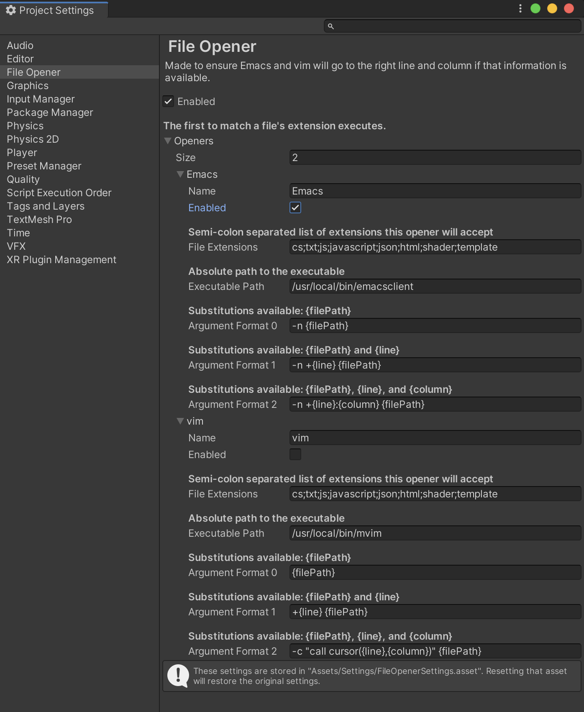

# FileOpener README

A file opener for Unity3d's editor. 

## Motivation

Ensure Emacs and vim go to the right line and column if that information is available. It is of course not restricted to use with any particular editor or program.

### Problem

It often seemed like the line and column information might not be passed along, or that a new process of my selected application would be spun up and fight for control over the file already being edited. 

### Solution

This package provides more control over the opening of the files you want. Any files not specified by their extensions will be opened by Unity by whatever means is specified in the External Tools panel in Preferences.

## Requirements

* Unity 2019.4 or later
* The will to edit on a non-sanctioned editor

## Installation

Open the Package Manager window in Unity. Click the plus drop down menu and select from git URL. Copy and paste the following URL:

```
https://github.com/shanecelis/FileOpener.git
```

### Usage

Open project settings. You will find a "File Opener" section.



Set up as you like. Double check the paths are correct on your computer. 

## TODO

* Add default paths for Windows and other platforms.

* Let user place settings.

  Settings currently kept at hard coded path `Assets/Settings/FileOpenerSettings.asset`

## License

This project is released under the MIT license.

## Acknowledgements

Many thanks to [Juan Karlo](https://twitter.com/accidentalrebel) for his [blog post](https://www.accidentalrebel.com/opening-unity-script-files-in-emacs.html) and [code](https://gist.github.com/accidentalrebel/69ac38f729e72c170a8d091b4daaec52) that showed me this was even possible.

This package template was originally generated from [Shane Celis](https://twitter.com/shanecelis)'s [unity-package-template](https://github.com/shanecelis/unity-package-template).
